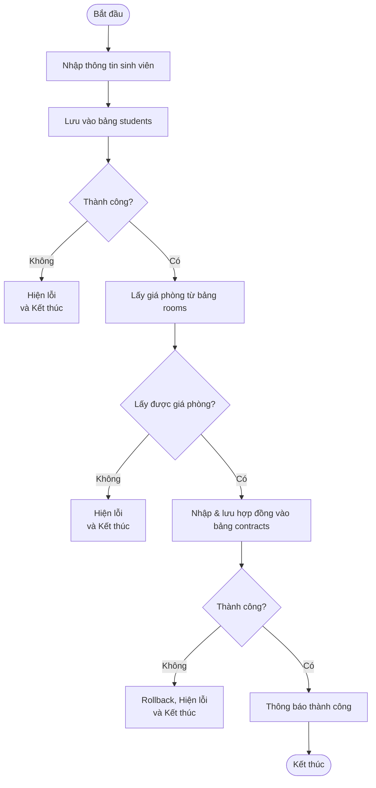

# Practice 1 – OOP_N01_Term3_2025_K17_Group9

## 1. Tiêu đề của bài tập lớn cuối kỳ

**Phần mềm quản lý ký túc xá**
*(Dormitory Management Software)*

---

## 2. Phân tích các đối tượng chính

Hệ thống có 4 đối tượng chính:

- **Sinh viên (Student):**
    - Thông tin cá nhân (họ tên, ngày sinh, giới tính, quê quán, ...)
    - Thông tin liên hệ
    - Thông tin về phòng ở
    - Thông tin về hợp đồng

- **Phòng (Room):**
    - Thông tin về phòng (số phòng, loại phòng, số giường, giá phòng, ...)
    - Danh sách sinh viên ở

- **Hợp đồng (Contract):**
    - Thông tin về hợp đồng (mã hợp đồng, ngày bắt đầu, ngày kết thúc, giá phòng, hình thức thanh toán, ...)

- **Phí (Fee):**
    - Thông tin về các loại phí (phí điện, phí nước, phí vệ sinh, ...)

---

## 3. Cấu trúc folder của Project
```plaintext
DormitoryManagement/
├── src/
│   ├── model/
│   │   ├── Student.java
│   │   ├── Room.java
│   │   ├── Contract.java
│   │   └── Fee.java
│   └── Main.java
├── test/
│   ├── TestStudent.java
├── README.md
```
---

## 4. Các class đã xây dựng

Chúng em viết 7 class cho 4 đối tượng đã xác định ở câu 2 (bao gồm class Main):

- **Đối tượng sinh viên:**
    - Student (class sinh viên)
- **Đối tượng phòng:**
    - Room (class phòng)
- **Đối tượng hợp đồng:**
    - Contract (class hợp đồng)
- **Đối tượng phí:**
    - Fee (class phí)
- **Các class bổ sung:**
    - FeeType (loại phí)
    - PaymentStatus (trạng thái thanh toán)
    - Main (class chạy chương trình)

(Các chức năng cơ bản của từng class đã trình bày ở Câu 2.)

---

## 5. Kiểm thử lớp Student

Để kiểm tra tính đúng đắn và ổn định của lớp Student, chúng em thực hiện kiểm thử các chức năng chính sau:

- Tạo mới sinh viên với đầy đủ thông tin cá nhân.
- Hiển thị thông tin sinh viên ra màn hình.
- Cập nhật, thay đổi thông tin của sinh viên (ví dụ: số điện thoại, địa chỉ, email).

Việc kiểm thử giúp đảm bảo lớp Student hoạt động chính xác, các thuộc tính được gán và lấy đúng giá trị.

---
# Chức năng chính: Thêm sinh viên kèm hợp đồng thuê KTX

## Mục tiêu

Khi người dùng nhập thông tin sinh viên mới, hệ thống sẽ:

1. Thêm sinh viên vào bảng `students`.
2. Lấy giá phòng từ bảng `rooms`.
3. Thêm hợp đồng thuê mới vào bảng `contracts`.

---

## I. Phân tích chức năng và phân chia công việc

### 1. Các bước xử lý

| Bước | Mô tả                                                         | Thành viên thực hiện           |
|------|---------------------------------------------------------------|-------------------------------|
| 1    | Nhập và lưu thông tin sinh viên vào bảng `students`           | Lê Duy Thái Dương             |
| 2    | Truy vấn lấy giá phòng từ bảng `rooms` dựa trên mã phòng      | Nguyễn Tùng Bách              |
| 3    | Nhập thông tin và lưu hợp đồng thuê vào bảng `contracts`      | Nguyễn Thành Dương            |

**Cả nhóm:** Tích hợp các hàm con thành quy trình hoàn chỉnh, kiểm thử và hoàn thiện báo cáo.

---

### 2. Lưu đồ thuật toán


## II.Ảnh chụp chạy kiểm thửthử

---
## Giao diện website
1. Giao diện chính
Khi truy cập vào trang web sẽ có giao diện như sau

Khi nhấn vào phần giới thiệu sẽ tạo pop-up để giới thiệu

2. Nhiệm vụ UI trong Practice 8
-Lê Duy Thái Dương: Danh sách sinh viên

-Nguyễn Thành Dương: Chi tiết sinh viên

-Nguyễn Tùng Bách: Thêm sinh viên


   

